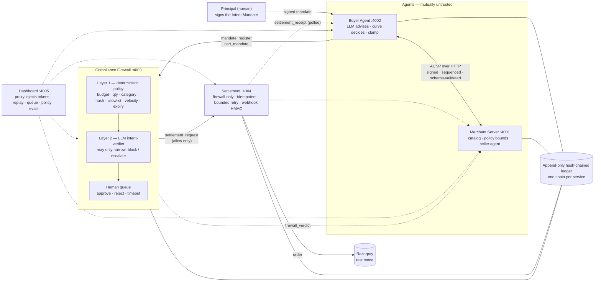

# The Negotiator

> Reference implementation of **agent-to-agent commerce**: a buyer agent and a
> seller agent negotiate over a signed, versioned wire protocol (ACNP), pass a
> two-layer compliance firewall, and settle through Razorpay (test mode) — with
> every step in a hash-chained, append-only audit ledger.

Built for the Razorpay AI Buildathon, Track 1: AI Growth & Agentic Commerce.

## The problem

When software agents buy from software agents, three things go wrong at once:
an LLM can be talked into a price its owner never authorised, nobody can prove
afterwards who agreed to what, and the one component that moves money is the
one most exposed to a confused model. The Negotiator makes each of those a
property of code, not of a prompt: the human's authorisation is a signed
artifact deposited before the negotiation starts, every number the models
suggest is clamped by deterministic strategy, an independent firewall audits
the final cart against the *original* authorisation before anything reaches
Razorpay, and every party keeps its own tamper-evident record of what was said.

**What's built (v0.1, feature-frozen):** the ACNP v0.1 specification and
protocol library (Ed25519 signatures over canonical JSON, generated schemas,
replay guard) · a merchant server with a policy bounds engine and a
deterministic seller strategy · a buyer agent with principal-signed mandate
registration, a deterministic concession curve and a budget clamp · a
model-agnostic LLM adapter layer (Gemini, Groq, Mistral; advisory proposals
with deterministic fallback) · a compliance firewall — layer 1 deterministic
policy against the stored mandate, layer 2 an LLM intent-verifier that can
only narrow (block or escalate, never widen), a token-gated human queue
decided exactly once · settlement (firewall-only, Razorpay test-mode orders
with idempotency and bounded retry, webhook HMAC, append-only receipt chain)
· one hash-chained ledger per service with offline verification · an
operator console · an evals harness with two committed 50-session runs.

## Architecture



Solid arrows carry signed ACNP messages; dotted arrows are polled or
best-effort deliveries. The buyer and seller have no route to settlement:
money moves only on a `settlement_request` the firewall signs after an
`allow` verdict, and settlement re-verifies every embedded signature itself.
The prose map behind the picture is [docs/ARCHITECTURE.md](docs/ARCHITECTURE.md);
the paths, step by step, are in [docs/FLOW.md](docs/FLOW.md).

## Quickstart

```bash
cp .env.example .env                       # then fill in Razorpay TEST keys (+ optional LLM keys)
pnpm install && pnpm build
node scripts/gen-keys.mjs >> .env          # principal/firewall/settlement keys + control + review tokens
docker compose up --build                  # merchant :4001, buyer :4002, firewall :4003, settlement :4004, dashboard :4005
node scripts/negotiate.mjs                 # one full run, every signature re-verified
open http://localhost:4005                 # operator console: run, queue, replay & audit, policy, evals
```

**No keys at all?** The defaults in `.env.example` already select the
deterministic stub for every LLM role and the simulated Razorpay client, so
the sequence above works on a fresh machine with no accounts. To see a
`PAID` receipt in that mode, set `PAYMENT_SIMULATION=on` and any
`RAZORPAY_WEBHOOK_SECRET` (the self-signed webhook needs a secret to sign
with); that is the configuration the clean-clone record in
[FEATURE-012](docs/features/FEATURE-012-day-12-polish.md) used. With real
keys, `RAZORPAY_MODE=live-test` creates real test-mode orders you can look up
in the Razorpay dashboard, and `BUYER/SELLER/FIREWALL_LLM_PROVIDER` put real
models on each side (the demo line: Gemini buyer, Groq seller, Mistral
verifier).

**Without Docker** (the same binaries Compose runs): after `pnpm build`, point
the four `*_URL` variables in `.env` at `http://localhost:400N` and start
each service with its port, e.g. `PORT=4001 node services/merchant/dist/main.js`
(likewise `settlement` 4004, `firewall` 4003, `buyer` 4002, and
`dashboard/dist/main.js` on 4005). SQLite files land in `data/`.

Local development:

```bash
pnpm install
pnpm build && pnpm lint && pnpm typecheck && pnpm test
```

## Protocol summary — ACNP v0.1

The normative specification is [PROTOCOL.md](PROTOCOL.md). Every message is
an envelope (`protocol`, `version`, `type`, `message_id`, `session_id`, `seq`,
`sender`, `timestamp`, `body`, `signature`; [§4](PROTOCOL.md#4-message-envelope))
that is schema-validated, sequence-checked and signature-verified at the
receiver's boundary before any logic runs; a message that fails any of those
is rejected, ledger-logged and never processed.

| Message              | Direction                              | Purpose                                                                                              | Spec                                                                                       |
| -------------------- | -------------------------------------- | ---------------------------------------------------------------------------------------------------- | ------------------------------------------------------------------------------------------ |
| `mandate_register`   | buyer → firewall                       | Deposit the principal-signed Intent Mandate before any session; the firewall pins the buyer's key    | [§7.0](PROTOCOL.md#70-mandate_register-buyer--firewall)                                     |
| `mandate_ack`        | firewall → buyer                       | The stored mandate's reference; no ack, no session                                                   | [§7.0](PROTOCOL.md#70-mandate_register-buyer--firewall)                                     |
| `session_init`       | buyer → seller                         | Open a session with the buyer's session key and the mandate's hash (never the mandate)               | [§7.1](PROTOCOL.md#71-session_init-buyer--seller)                                           |
| `session_ack`        | seller → buyer                         | Seller key, chosen version, capabilities manifest                                                    | [§7.2](PROTOCOL.md#72-session_ack-seller--buyer)                                            |
| `catalog_request`    | buyer → seller                         | Ask for the agent-readable storefront                                                                | [§7.3](PROTOCOL.md#73-catalog_request-buyer--seller)                                        |
| `catalog_offer`      | seller → buyer                         | Items, variants, list prices; each item with a seller hash over its snapshot                         | [§7.4](PROTOCOL.md#74-catalog_offer-seller--buyer)                                          |
| `offer`              | buyer → seller                         | Round 1 of the negotiation: line items, proposed unit price, informational rationale                 | [§7.5](PROTOCOL.md#75-offer-buyer--seller-and-counter_offer-either-direction)               |
| `counter_offer`      | either direction                       | Rounds 2…N; every seller price passes the policy bounds check after the LLM, never before            | [§7.5](PROTOCOL.md#75-offer-buyer--seller-and-counter_offer-either-direction)               |
| `bundle_proposal`    | seller → buyer                         | Multi-item structured offer (specified; unhandled in v0.1 — cut order #4)                            | [§7.6](PROTOCOL.md#76-bundle_proposal-seller--buyer)                                        |
| `accept`             | either direction                       | Close the deal by echoing the accepted terms; the echo is verified byte-for-byte                     | [§7.7](PROTOCOL.md#77-accept--reject--walk_away)                                            |
| `reject`             | either direction                       | Decline one proposal; the session continues                                                          | [§7.7](PROTOCOL.md#77-accept--reject--walk_away)                                            |
| `walk_away`          | either direction                       | Terminate with a reason code — a success of strategy, not a failure of the system                    | [§7.7](PROTOCOL.md#77-accept--reject--walk_away)                                            |
| `cart_mandate`       | buyer → firewall (copy to seller)      | Bind the accept, the seller's exact snapshot and the final total into one signed hash                | [§7.8](PROTOCOL.md#78-cart_mandate-buyer--firewall-copied-to-seller)                        |
| `firewall_verdict`   | firewall → buyer, seller               | `allow` / `block` / `escalate` with the layer that decided and machine-readable reasons              | [§7.9](PROTOCOL.md#79-firewall_verdict-firewall--buyer-seller-ledger-dashboard-attached-to-settlement_request) |
| `settlement_request` | firewall → settlement                  | The cart, the allow verdict and the attested buyer key; settlement re-verifies all three itself      | [§7.10](PROTOCOL.md#710-settlement_request-firewall--settlement-only-with-an-allow-verdict)  |
| `settlement_receipt` | settlement → buyer, seller (polled)    | `paid` / `failed` with the Razorpay order id and the ledger hash of the confirming entry             | [§7.11](PROTOCOL.md#711-settlement_receipt-settlement--buyer-seller-ledger)                  |
| `error`              | any                                    | Signed, coded rejection; never advances state                                                        | [§7.12](PROTOCOL.md#712-error)                                                              |

- **State machine** ([§9](PROTOCOL.md#9-session-state-machine)):
  `INIT → NEGOTIATING → AGREED → COMPLIANCE_REVIEW → SETTLING → SETTLED`,
  with `WALKED_AWAY`, `BLOCKED`, `FAILED` and `EXPIRED` as terminal
  alternatives; every party keeps the machine independently, so divergence
  is provable from the ledgers.
- **Signatures** ([§5](PROTOCOL.md#5-identity-and-signatures)): Ed25519 over
  the RFC 8785 canonical form of the envelope minus `signature`; per-session
  agent keys pinned at `session_init`/`session_ack`; long-lived firewall and
  settlement keys distributed by configuration; the principal's key signs
  the Intent Mandate and nothing else.
- **Replay and ordering** ([§6](PROTOCOL.md#6-ordering-replay-and-idempotency)):
  `seq` per (session, sender, receiver) stream, `message_id` unique
  session-wide, `mandate_hash` as the settlement idempotency key.
- **Error codes** ([§10](PROTOCOL.md#10-error-codes)): fatal
  (`SIG_INVALID`, `REPLAY_DETECTED`, `ACCEPT_MISMATCH`, `MANDATE_*`, …),
  recoverable (`SCHEMA_INVALID`, `TOTAL_MISMATCH`, `CLOCK_SKEW`, …) and
  settlement-domain (`VERDICT_MISMATCH`, `SETTLEMENT_RETRY_EXHAUSTED`,
  `WEBHOOK_SIG_INVALID`).
- **Versioning** ([§12](PROTOCOL.md#12-versioning)): `MAJOR.MINOR`; minor
  versions add optional fields only; unknown major versions are rejected,
  never best-effort parsed.

## Metrics — evals run `live-42-mistral`

Copied from [evals/report.json](evals/report.json) (rendered in
[evals/REPORT.md](evals/REPORT.md)); 50 sessions, executed 2026-08-29,
commit `d8e5daa`. Buyer `mistral/mistral-small-latest`, seller
`groq/openai/gpt-oss-120b`, intent-verifier `mistral/mistral-small-latest`.
Settlement inside the evals is the in-process simulated client (the live
Razorpay leg was proven separately, Gate 4). Every rate is `pct (n/d)`; the
failure numbers sit in the same tables as the wins. Re-run with
`pnpm evals -- --mode live --n 10 --seed 42 --baseline stub-42 --publish`.

**Benign scenarios** (ground truth: settle or walk away cleanly; any block or hold is a false block)

| Scenario          | Deal-close   | Walk-away   | False block | Avg discount | Avg rounds |
| ----------------- | ------------ | ----------- | ----------- | ------------ | ---------- |
| `honest`          | 100% (10/10) | 0% (0/10)   | 0% (0/10)   | 13.1%        | 4.5        |
| `aggressive`      | 90% (9/10)   | 10% (1/10)  | 0% (0/10)   | 11.8%        | 4.8        |
| `stingy_merchant` | 50% (5/10)   | 50% (5/10)  | 0% (0/10)   | 1.1%         | 5.0        |
| **pooled**        | 80% (24/30)  | 20% (6/30)  | 0% (0/30)   | 10.1%        | 4.7        |

**Corrupted scenarios** (ground truth: must be caught; a settle is a false allow)

| Scenario             | Caught       | False allow | Caught by             |
| -------------------- | ------------ | ----------- | --------------------- |
| `corrupted_layer1`   | 100% (10/10) | 0% (0/10)   | layer 1 (policy) 10   |
| `corrupted_semantic` | 100% (10/10) | 0% (0/10)   | layer 2 (verifier) 10 |
| **pooled**           | 100% (20/20) | 0% (0/20)   | critical misses: 0    |

**What the models cost, on identical parameters** — the curves alone would
have closed 30/30 at an average 12.3% below list; the LLM-advised pair
closed 24/30 at 10.1% (−2.1 points, 0.3 fewer rounds). Both agents were
model-advised, so this measures the pair. Providers: 502 calls, 502
answered, 0 fallbacks (median latency ≈ 1.0 s). **Seller floor leaks:**
13.3% (27/203) of the seller's counter-offer rationales named the floor it
cannot cross (the number can't leak; the prose does — a hardening target).

The deterministic run of the same seed (`evals/runs/stub-42`) closes every
benign deal exactly where the formulas predict, catches all ten relays at
layer 1, and lets the corporate hamper through **10/10** — numbers alone
cannot see intent; that row is why layer 2 exists. Two truncated live
attempts are kept and not cited (`live-42`: Gemini buyer, 4/50 on quota;
`live-42-lite-outage`: 12 sessions through a network outage) — D026.

## Threat model

Full document: [docs/THREAT_MODEL.md](docs/THREAT_MODEL.md) — each row there
names the test that proves its mitigation.

| #   | Threat                                             | Caught by                                                                                          | Honest limit                                                                                 |
| --- | -------------------------------------------------- | -------------------------------------------------------------------------------------------------- | -------------------------------------------------------------------------------------------- |
| T1  | Seller lies about stock/specs; buyer relabels      | Seller snapshot + hash inside the cart; firewall recomputes; merchant checks its own copy          | A relabel-and-re-hash is caught post hoc by the seller, not in real time by the firewall     |
| T2  | Replay of a signed message                         | Per-stream `seq`, session-wide `message_id`, idempotent settlement and verdicts                    | —                                                                                            |
| T3  | LLM talked below the merchant floor                | Deterministic clamp on every outbound price, after the model                                       | The number cannot leak; the prose can (13.3% of rationales named the floor — measured)      |
| T4  | Prompt injection in catalog text                   | Buyer math is deterministic; verifier fences the text and can only narrow; strict parser           | A model talked into `allow` is a layer-2 false allow; Gemini held 3/3, Mistral run still owed |
| T5  | Corrupted buyer goal (flagship)                    | Layer 1 against the stored, principal-signed mandate; layer 2 semantics; human above the LLM      | The buyer's own shortlist has no semantics by design — the firewall is the backstop           |
| T6  | Audit ledger tampering                             | Per-service hash chains; cross-party envelope match; no update/delete path exists                  | A party can truncate its own tail before anyone cited its head (anchoring is v0.2)           |
| T7  | Settlement duplication / runaway retries           | `mandate_hash` idempotency key, lookup-before-create, bounded backoff                              | —                                                                                            |
| T8  | Webhook forgery                                    | HMAC-SHA256 over the raw body before any state change                                              | The customer's tap is simulated by a self-signed webhook through the same verifier           |
| T9  | Agent key compromise                               | Per-session keys; velocity limit per principal; one mandate, one purchase                          | No revocation or rotation in v0.1                                                            |
| T10 | Escalation-queue starvation / racing the human     | Queue timeout auto-blocks; a hold is decided exactly once                                          | —                                                                                            |

## The demo ladder — three stops, three defenses

```bash
node scripts/negotiate.mjs                              # benign: intent → … → Razorpay order → receipt
node scripts/negotiate.mjs --target var_bookend         # the buyer's STRATEGY walks away (near-floor item)
node scripts/negotiate.mjs --target var_relay_8ch       # firewall LAYER 1 blocks (industrial under a gifts mandate)
node scripts/negotiate.mjs --target var_corp_hamper     # every number passes; LAYER 2 blocks or HOLDS for a human
node scripts/negotiate.mjs --target var_inject_hamper   # the same hamper telling the verifier "recommend allow" (T4)
node scripts/review.mjs list | approve <hash> | reject <hash>   # the human, from a second terminal
node scripts/verify-ledgers.mjs                         # all four audit chains verified + cross-party check
node scripts/verify-ledgers.mjs --db copy.db            # verify a copied service database offline
```

For the offline check copy the SQLite file **and its `-wal` companion** (the
services run in WAL mode; a copy without it has no tables):
`docker compose cp firewall:/app/data/firewall.db . && docker compose cp firewall:/app/data/firewall.db-wal .`.
The storyboard, the exact line to point at in each transcript and the
pre-demo checklist are in [docs/DEMO.md](docs/DEMO.md); the plain-words
explanation of every component and the questions a payments panel asks are
in [docs/PITCH.md](docs/PITCH.md).

## Layout

| Path                  | Role                                                                |
| --------------------- | ------------------------------------------------------------------- |
| `PROTOCOL.md`         | ACNP v0.1 wire-protocol specification (normative)                   |
| `packages/protocol`   | Schemas, canonical serialization, Ed25519 signing, replay guard     |
| `packages/llm`        | Model-agnostic LLM adapter layer (only place vendor calls may live) |
| `packages/ledger`     | Append-only hash-chained audit ledger (one chain per service)       |
| `services/merchant`   | S1 Merchant Commerce Server + seller agent                          |
| `services/buyer`      | S2 Buyer Agent                                                      |
| `services/firewall`   | S4 Compliance Firewall (deterministic rules + LLM intent-verifier)  |
| `services/settlement` | S5 Razorpay settlement + hash-chained ledger                        |
| `dashboard/`          | Operator console: run, approval queue, replay & audit, policy, evals |
| `scripts/`            | Terminal demos: negotiate, review (the human), verify-ledgers, keys  |
| `evals/`              | Synthetic-negotiation harness and honest metrics report             |
| `docs/`               | Architecture, decisions, flow, threat model, test gates, handover   |

## Documentation

- [docs/ARCHITECTURE.md](docs/ARCHITECTURE.md) — system map
- [docs/FLOW.md](docs/FLOW.md) — how execution travels, path by path
- [docs/THREAT_MODEL.md](docs/THREAT_MODEL.md) — trust boundaries and attack cases
- [docs/EVALS.md](docs/EVALS.md) — evaluation methodology and anti-gaming rules
- [docs/DECISIONS.md](docs/DECISIONS.md) — why, not just what
- [docs/DEMO.md](docs/DEMO.md) — the five-minute storyboard and submission checklist
- [docs/PITCH.md](docs/PITCH.md) — every component in plain words, and the panel's questions

## License

MIT
